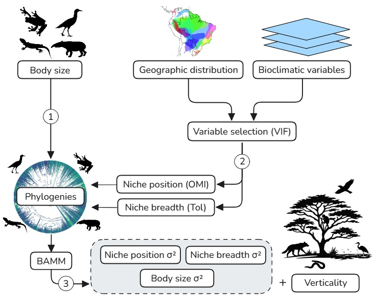

# About this repository

## Motivation

This repository contains the data and code used in the manuscript "Divergent pathways shape climatic niches and body size evolution across terrestrial vertebrates". In this study, we investigated the relationship between the evolution of climatic niche, body size, and microhabitat use among terrestrial vertebrates. Our goal was to identify the direction and strength of evolutionary associations among these traits and to test whether these relationships follow common or lineage-specific pathways. By combining large-scale climatic and trait datasets, we revealed how distinct evolutionary mechanisms have shaped the evolutionary pathways of amphibians, reptiles, birds, and mammals through time.

## How to use

### File structure

The [GitHub](https://github.com/mmoroti/vertebrates_evolution) repository contains three scripts:

-   **`01_extraction.qmd`** – Generates the priors for BAMM, checks the convergence of the runs, calculates the median evolutionary rates, and extracts the rate-through-time matrix. It uses trait data from [TetrapodTraits](https://zenodo.org/records/10582070), and the phylogenies used are available on [Zenodo](link)

-   **`02_metrics/02_metrics.qmd`** – Builds the community matrix for each terrestrial vertebrate group, loads the bioclimatic variables per grid, and calculates the niche position and breadth for each species. The results feed into **`01_extraction.qmd`**, but they can also be downloaded directly from [Zenodo](link)

-   **`03_analysis/03_analysis.qmd`** – Performs structural equation modeling analyses incorporating phylogenetic autocorrelation, runs sensitivity tests, and generates the main figures of the manuscript, which were later refined in InkScape.

The [Zenodo](link) deposit contains the following folders:

-   **`BAMM/`** – Contains all files generated by BAMM. Inside, there are three subfolders:

    -   **`body_size/`** – Evolutionary rates for body size for each vertebrate group.
    -   **`niche_position/`** – Evolutionary rates for climatic niche position.
    -   **`niche_breadth/`** – Evolutionary rates for climatic niche breadth.

-   **`traits/`** – Species-level data, including niche metrics and trait data from [TetrapodTraits](https://zenodo.org/records/10582070).

-   **`spatial_data/`** – Shapefiles and species distribution data for each vertebrate group derived from [TetrapodTraits](https://zenodo.org/records/10582070).

### Description

The workflow follows three main steps: (1) obtaining evolutionary metrics (**`01_extraction.qmd`**), (2) calculating climatic niche metrics (**`02_metrics.qmd`**), and (3) testing causal relationships through structural equation modeling (**`03_analysis.qmd`**). Climatic niche metrics are generated in the **`02_metrics.qmd`** script, and the resulting values serve as input for **`01_extraction.qmd`**, which is executed twice: first to extract evolutionary rates of body size, and later to obtain evolutionary rates of the climatic niche.

To reproduce the full analytical workflow:

-   Run **`01_extraction.qmd`** to extract evolutionary rates of body size;

-   Run **`02_metrics.qmd`** to calculate climatic niche metrics;

-   Run **`01_extraction.qmd`** again to extract evolutionary rates of the climatic niche;

-   Run **`03_analysis.qmd`** to perform structural equation modeling and generate the main figures of the manuscript.

*Figure 1. Overview of the analytical workflow used in this study, from data preparation to final analyses.*

### Usage notes

R 4.4.1 software is required to open and ensure reproducibility of all scripts. All analyses were performed in R and are fully reproducible using the materials provided here and on [Zenodo](https://doi.org/10.5281/zenodo.17591794).

## License

The code and data in this repository are provided for peer review and collaboration purposes only. **They are not licensed for public use or redistribution** until the associated manuscript is formally published. If you are interested in using this material before publication, don't hesitate to get in touch with the author at [mmoroti\@gmail.com](mailto:mmoroti@gmail.com).

## Citation

If you use these data or code, please cite: Moroti, M. de T., Moura, M., Pires, M. M., & Provete, D. B. (2025). Divergent pathways shape climatic niches and body size evolution across terrestrial vertebrates [Data set]. Zenodo. <https://doi.org/10.5281/zenodo.17591794>

This readme file was generated on [2025-11-12] by Matheus de T. Moroti.

  
